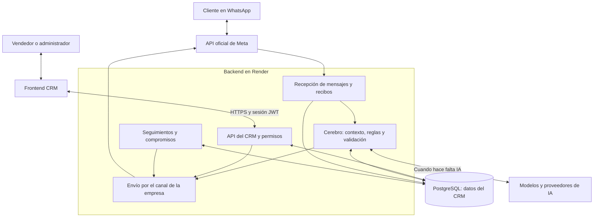
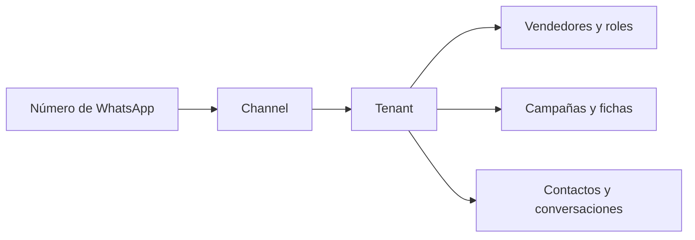
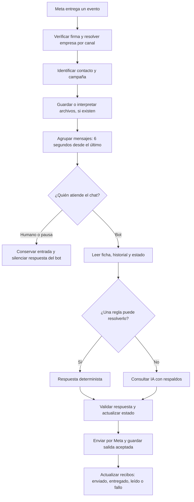
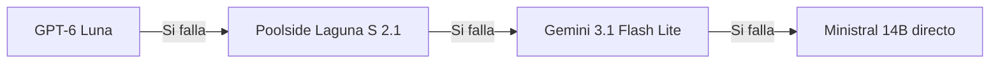
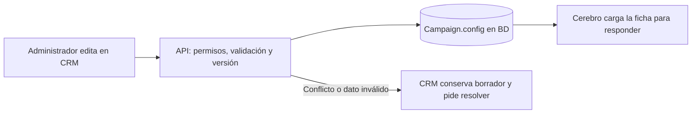

# Guía del backend y preparación del CRM

> **Actualización 2-oct-2026 (Hito A y B).** Este documento describía el estado **antes** de
> cerrar el backend operativo v1. Lo que cambió, con su evidencia, está en
> [HANDOFF-PARA-CODEX.md](../HANDOFF-PARA-CODEX.md), [contrato-crm.md](contrato-crm.md) y
> [estado-despliegue-crm.json](estado-despliegue-crm.json). Los apartados siguientes se
> conservan como descripción del **punto de partida**: siguen siendo válidos para entender el
> diseño, pero las cifras y los «pendientes» que aquí se listan ya se resolvieron.
>
> Resumen de lo resuelto frente a lo que este documento señalaba como pendiente:
> recepción durable (§8, fila «Recepción durable») → `inbound_events`; envío durable →
> `outbound_messages` con estado incierto; estado comercial → `lead_state.turno_pendiente`;
> transcripción con humano delante → no se transcribe; followups → filtro antes del `LIMIT` y
> reserva atómica; promesas prohibidas → se neutralizan; costo del copiloto → se eliminó; 401
> sin cierre de sesión, borradores cruzados y respuesta obsoleta del copiloto → cerrados con
> `claveDeCache`, `drafts.ts` y `editor-estado.ts`; filtros de la bandeja → en el servidor con
> `total` real; Campaigns/Flujos → alta, ficha, disparadores, guion y activación desde el CRM.

**Proyecto:** `berthidalgo/whatsapp-sales-backend` · **Código examinado:** `298b32b` · **Fecha:** 1 de octubre de 2026, Perú.

Esta guía explica el sistema que existe hoy. Se revisaron archivos y contratos; se consultaron `/health` y `/ready` en producción. No se modificó la aplicación, no se enviaron mensajes y no se hicieron llamadas a modelos de OpenRouter.

## 1. Qué tenemos y si podemos empezar el frontend

**Sí: podemos continuar la construcción del CRM de ventas v1 con este backend.** Hay API desplegada, base de datos preparada, conexión oficial con Meta, cerebro con respaldos y contratos para las funciones principales. También existe una primera interfaz en `apps/web`; el trabajo siguiente es completarla e integrarla.

**Todavía hay pendientes para aprobar el CRM completo para uso general.** Hay riesgos concretos de sesión y borradores en la interfaz, varias funciones administrativas aún sin pantalla/API y límites de recuperación de mensajes ante reinicios. Están detallados en la sección 8.

Piensa en cuatro partes:

| Parte | Explicación sencilla | Dónde está |
| --- | --- | --- |
| Frontend / CRM | El escritorio del vendedor y del administrador: conversaciones, clientes, fichas y campañas. | React + TypeScript + Vite, `apps/web`. |
| Backend / API | Atiende peticiones, comprueba permisos, coordina WhatsApp y ejecuta las reglas comerciales. | Node.js + Fastify, `apps/api`, desplegado en Render. |
| Cerebro | Decide cómo atender un turno: reglas, contexto, IA, validación y derivación humana. | Un componente dentro del backend. |
| Base de datos | Conserva empresas, canales, equipo, contactos, conversaciones, configuración y seguimiento. | PostgreSQL / Supabase, accedido mediante Prisma. |

**La base de datos ya contiene información del CRM y del bot.** La existencia de una tabla no significa que su pantalla o todas sus operaciones de administración estén terminadas.

## 2. Mapa general del sistema

El navegador usa la API autenticada. Los secretos de Meta, OpenRouter y la base de datos pertenecen al servidor.

### Cómo conviven las empresas

Un **tenant** es una empresa o espacio independiente: Perú Exporta, BIOAYUR o Hidata. El número de WhatsApp que recibe el mensaje identifica un `Channel`; ese canal identifica al tenant. Después se busca al contacto dentro de esa empresa.

Este dibujo muestra pertenencia conceptual. No todas esas relaciones tienen una clave foránea directa a `TenantSettings`: el servidor también comprueba `tenantId` y permisos. Un administrador o supervisor opera dentro de su empresa; un vendedor accede a sus propios leads.

La operación actual usa **Meta Cloud API**. El repositorio conserva un adaptador legacy de Evolution, que no forma parte del recorrido actual mostrado aquí.

## 3. Qué ocurre cuando escribe un cliente

1. **Recepción:** `/webhook/cloud` valida la firma del evento. Los recibos de entrega tienen su propio procesamiento y no necesitan el modelo conversacional.
2. **Empresa y contacto:** el número receptor identifica el canal; el contacto se distingue por empresa y teléfono/identificador. La campaña inicial se resuelve con triggers, anuncio o campaña general. Un mensaje posterior no reasigna automáticamente una campaña existente.
3. **Archivos:** se descargan medios admitidos y se guardan sus bytes en PostgreSQL, con un límite actual de 8 MB por archivo. Un audio sin texto puede transcribirse; una imagen sin texto puede describirse. Un PDF o video se conserva, pero no se lee automáticamente.
4. **Ráfagas:** varios mensajes próximos se agrupan en un turno. El tiempo percibido por el cliente incluye esos 6 segundos, la preparación, la IA y el envío. La latencia de un benchmark del modelo no es toda la latencia del bot.
5. **Humano/bot:** se consulta el modo de atención. `HUMAN_ACTIVE` puede volver al bot con un mensaje posterior al umbral de inactividad humana, cuyo valor por defecto en código es 6 horas. `PAUSED` no vuelve por esa vía.
6. **Contexto:** se carga la ficha de campaña, etapa comercial, datos recogidos y los últimos 12 mensajes, además de memoria disponible de conversaciones anteriores.
7. **Reglas e IA:** ciertas situaciones, como vulnerabilidad grave, pueden resolverse por regla sin tokens conversacionales. Si hace falta IA, se usa la cadena de modelos.
8. **Validación y envío:** se comprueban formato, reglas del vertical y precios de la ficha; se evita enviar una respuesta obsoleta cuando llegó otra entrada o tomó control un humano. Meta devuelve un identificador del mensaje aceptado y se registra la salida.
9. **Recibos:** `sent` significa aceptado para envío; `delivered` y `read` llegan después. Un recibo que llega antes del registro del mensaje se conserva en `PendingCloudReceipt` para conciliación posterior.

### Cadena de respaldo configurada en el despliegue

Los respaldos se prueban cuando corresponde por fallo; una conversación normal no consulta los cuatro modelos a la vez. Reintentos, rescates y correcciones pueden producir más de una llamada. Audio, visión, copiloto y debrief también tienen sus propios consumos: el modelo principal no representa todo el gasto de IA.

La comprobación de salud consultada muestra **4/4 proveedores vivos en la última verificación del arranque**. Es un resultado almacenado de esa verificación, no un test nuevo ejecutado para esta guía.

Un comprobante de pago puede derivarse a un humano. Recibir una captura no equivale a verificar el pago ni a confirmar una venta.

## 4. Qué ocurre cuando responde un vendedor

El CRM pide al backend enviar el texto al lead seleccionado. El servidor comprueba sesión, pertenencia del contacto, canal propio y política de envío. Si Meta acepta el envío, registra la respuesta y toma control humano. La pantalla debe conservar el borrador cuando falla.

**Ventana de atención:** dentro de las 24 horas desde el último mensaje del usuario puede responderse sin plantilla; fuera de ella se requiere una plantilla aprobada. Es la regla publicada por [WhatsApp Business](https://whatsappbusiness.com/policy/). El backend devuelve `409` con información de ventana cerrada y plantilla disponible.

El vendedor puede solicitar la reapertura. La UI debe mostrar **«plantilla enviada; esperando respuesta del cliente»**: enviar una plantilla no equivale a recibir la respuesta necesaria para volver a texto libre.

Si el canal opera en coexistencia y Meta comunica una respuesta enviada desde el celular, el backend guarda el echo como mensaje del vendedor y silencia el bot. Que el código soporte coexistencia no confirma que todos los canales actuales estén configurados así.

El CRM también puede cambiar modo, etiquetar, reasignar con permiso administrativo y guardar el resumen de una llamada. **Modo de atención, etapa comercial y pago confirmado son conceptos distintos.**

## 5. La ficha comercial se administra desde el CRM

La ficha reúne lo que el bot puede decir del negocio: oferta, precio, contenido, condiciones e identidad comercial; la configuración del agente acompaña esos datos.

**Ruta normal:** el CRM lee la ficha y su `version`, edita un borrador y lo guarda. El backend valida y actualiza atómicamente `Campaign.config`, incrementando la versión. El cerebro lee esa configuración desde la base.

| Origen | Para qué sirve hoy | Qué debe entender el operador |
| --- | --- | --- |
| `Campaign.config` en BD | Ficha y configuración comercial utilizadas por el cerebro. | Es la fuente operativa del editor CRM. |
| `data/tenants/*.json` | Datos iniciales y alta mediante seed; registro de vertical por tenant. | Editar un archivo no guarda automáticamente una ficha del CRM. El seed distingue origen `seed`/`dashboard`. |
| Otros JSON de ejecución | Defaults, seguimientos, catálogo de plantillas y referencias de assets. | Algunos todavía se administran por archivos o scripts. |
| Código | Validación, seguridad, aislamiento, reglas críticas y comportamiento de verticales. | Cambiar un precio desde el CRM no reemplaza una regla de seguridad. |
| Assets comerciales | La ficha referencia archivos permitidos del tenant, actualmente en disco. | No existe todavía un gestor completo de cargas desde el CRM. |

Por tanto, **la ficha comercial ya se guarda en BD; aún no está toda la configuración disponible como autoservicio desde el frontend**.

El editor debe manejar `400` (dato inválido), `428` (falta versión) y `409` (conflicto). Omitir un campo conserva su valor; `null` solicita borrarlo y requiere confirmación cuando elimina datos existentes. Confirmar no permite quitar campos obligatorios de una ficha activa.

El copiloto propone cambios y puede consumir IA. El guardado y la validación de ficha pueden hacerse sin IA. El preview de validación del servidor no guarda ni llama al modelo.

## 6. Qué guarda la base de datos: los 19 modelos

El lead es el centro del trabajo comercial; se enlaza con equipo, campaña, historial y seguimiento.

| Área | Modelo | Qué conserva |
| --- | --- | --- |
| Empresa | `TenantSettings` | Identidad de la empresa, campos de suscripción y contadores/cuotas. Tener estos campos no implica cobro automático ni gestión completa por UI. |
| Canal | `Channel` | Número receptor, tenant, proveedor, configuración y canal de envío por defecto. |
| Equipo | `Vendor` | Vendedor, rol, empresa y autenticación por PIN. |
| Campaña | `Campaign` | Campaña, ficha/configuración JSON, versión y vendedor asociado. |
| Activación | `Trigger` | Expresiones que ayudan a seleccionar la campaña inicial. |
| Flujo | `FlowStep` | Pasos ordenados de mensaje, seguimiento o aviso. |
| Configuración anterior | `BotConfig` | Configuración legacy por tenant; no es la ficha principal de campaña. |
| Contacto | `Lead` | Cliente potencial, empresa, campaña, vendedor y archivo lógico. |
| Estado | `LeadState` | Modo, etapa, etiquetas, datos recogidos y datos pendientes. |
| Episodio | `Conversation` | Agrupación de una conversación y su relación con lead/campaña/equipo. |
| Mensaje | `Message` | Entrada o salida, origen, fecha, identificador de Meta y estado de envío. |
| Archivo recibido | `MediaAsset` | Imagen, audio, documento o video asociado al lead; bytes y metadatos. |
| Llamada | `CallEvent` | Resultado, notas y datos registrados de una llamada. |
| Compromiso | `Commitment` | Acuerdo, fecha y cumplimiento/recordatorio. |
| Seguimiento | `FollowupQueueItem` | Registros de seguimiento, contexto y resultado. No es una cola durable de todos los turnos del bot. |
| Aviso | `CrmNotification` | Avisos al vendedor con prioridad y contacto opcional. |
| Traza | `TurnTrace` | Contexto, decisiones, validaciones, errores y tiempos de un turno. |
| Recibo temprano | `PendingCloudReceipt` | Estado enviado por Meta antes de que exista el mensaje saliente en BD. |
| Prueba | `TestPhone` | Lista operativa de teléfonos de pruebas, sin pertenencia de tenant en este modelo. |

No hay modelos normalizados independientes de producto, orden, pago o inventario. Los datos actuales de oferta/pedido se representan en ficha y estado. Si el CRM incorpora almacén, conciliación de pagos, facturación o pedidos completos, habrá que definir esos módulos y sus contratos.

## 7. Pantallas existentes y contratos disponibles

| Función del CRM | Backend disponible | Interfaz actual |
| --- | --- | --- |
| Entrar al sistema | Login, JWT, roles, alcance y cambio de PIN. | Login existente; falta cerrar correctamente expiración y cambio de sesión. |
| Bandeja de clientes | Lista, detalle y paginación `limit/offset`. | Inbox con búsqueda/filtros locales y polling cada 10 s; falta integrar lista paginada. |
| Conversación | Historial con cursor, medios privados, estados de envío. | Conversation con carga de historial anterior y recibos. |
| Atención humana | Responder, plantilla de reapertura, modo, etiqueta y reasignación. | Acciones implementadas; falta aislar el borrador por contacto. |
| Ficha comercial | Leer/guardar con versión y preview de validación. | Agent Playground existente; faltan confirmación de borrado y preview conectado al servidor. |
| Copiloto | Proponer cambios a ficha y agente. | Integrado en Agent Playground; requiere proteger cambios de campaña durante la petición. |
| Campañas y flujos | Alta y detalle v2; edición/activación/triggers/pasos por rutas protegidas `/campaigns`. | Falta recorrido completo de crear y activar campaña y editar sus pasos. |
| Resultado de llamada | Preparar debrief y guardarlo como llamada. | Modal de nota/voz y revisión; no es un calendario completo. |
| Administración del equipo | Rutas legacy protegidas para vendedores. | Falta panel administrativo completo. |
| Canales, cuotas y plantillas | Configuración en BD/JSON/scripts; sin CRUD HTTP completo de administración. | Necesitan contratos adicionales si se incluyen en esta etapa. |
| Seguimientos, trazas y reportes | Registros y algunas lecturas/reportes básicos. | Falta gestión completa y paneles de observabilidad. |

`FlowCopilot.tsx` existe, pero no está montado en la aplicación. El copiloto utilizado está dentro de `AgentPlayground`. El botón «BRAIN» está deshabilitado. El «Preview en Vivo» del editor representa mensajes locales predeterminados; todavía no demuestra una conversación real con el cerebro.

Los métodos `previewAgentConfig` y `previewTurno` están disponibles para integrar validaciones/simulaciones sin llamada al modelo. No deben presentarse como prueba generativa completa.

## 8. Preparación comprobada y pendientes

### Estado comprobado

Consulta en vivo: **1-oct-2026, 21:49:37 Perú** (`2026-10-02T02:49:37Z`).

| Evidencia | Resultado |
| --- | --- |
| Producción `/health` | `ok`, commit `298b32b`. |
| Producción `/ready` | `ready`, esquema `20261001`, 19 modelos. |
| Despliegue registrado | Render `live`, mismo commit. |
| Verificación anterior del paquete desplegado | Backend offline 619/619; PostgreSQL + HTTP 11/11; unión de historial web 5/5; builds de API y web aprobados. |
| CI registrada | Backend, frontend y PostgreSQL/HTTP/migraciones aprobados. |

Los tests de la tabla corresponden a la verificación del despliegue, **no se volvieron a ejecutar para redactar esta guía**. Health/readiness comprueban servicio y preparación de BD; no certifican por sí solos todos los recorridos de un usuario en el navegador.

### Antes de aprobar la interfaz para uso general

Estos escenarios se identificaron por lectura del código y revisión de componentes padres; no se reprodujeron en navegador en esta revisión.

| Prioridad | Pendiente concreto | Resultado que necesitamos |
| --- | --- | --- |
| Alta | Un `401` borra almacenamiento, pero no cambia el usuario de `App`; la caché global tampoco se limpia al cambiar sesión. | Volver al login, limpiar/cancelar consultas y separar datos por usuario/tenant. |
| Alta | Escribir para el lead A y seleccionar B conserva el texto del compositor. | Borradores por contacto o confirmación/reset; ninguna acción puede enviar el borrador de A a B. |
| Alta | Una respuesta tardía del copiloto de campaña A puede modificar el borrador de B; cambiar campaña descarta cambios pendientes. | Asociar petición/respuesta a campaña, ignorar resultados obsoletos y conservar/confirmar borradores. |
| Media | El editor no transmite la confirmación de borrado y su preview visible es local. | Implementar el contrato real de borrado, validación y conflictos. |
| Media | La creación/activación completa de campañas no está conectada a pantallas. | Poder configurar y activar una campaña nueva sin preparar sus datos fuera del CRM. |

### Límites del backend que condicionan operación y crecimiento

| Tema | Situación actual | Consecuencia |
| --- | --- | --- |
| Recepción durable | Se confirma el webhook antes de completar su persistencia; debounce y locks viven en memoria. | Un reinicio puede perder entradas pendientes. Falta una bandeja durable de entrada y procesamiento recuperable. |
| Envío durable | Aceptación de Meta y registro en BD son operaciones separadas; no hay outbox completo. | Puede enviarse algo que no quede registrado si falla la escritura posterior. |
| Varias instancias | Deduplicación, buffer y locks no se coordinan entre procesos. | La operación examinada es de una instancia; antes de varias réplicas se necesita coordinación/cola durable. |
| Estado comercial | Etapa y slots se guardan antes del envío y pueden sobrevivir a una salida descartada/fallida. | Una etapa no prueba que el cliente recibió una confirmación ni que pagó. |
| IA con bot silenciado | La transcripción/visión de media Cloud ocurre antes del control humano/pausa. | Puede existir consumo de IA aunque no se emita respuesta conversacional. |
| Cuotas y costos | El contador incluye reglas de cero tokens y no bloquea al superar cuota; la UI del copiloto usa un costo estimado fijo. | Contador de turnos y cifra visual no equivalen a saldo real ni facturación exacta. |
| Followups | El lote se limita antes de descartar contactos demasiado antiguos. | Candidatos viejos pueden ocupar el lote e impedir seguimientos elegibles; conviene corregir la selección antes de depender del cron. |
| Seguridad de respuesta | Hay reglas y defensas de precio/vulnerabilidad; algunos flags de promesas genéricas solo señalan el problema. | No puede afirmarse que toda frase prohibida se bloquea automáticamente. |
| Configuración completa | Canales, plantillas, assets y algunas políticas siguen fuera del editor. | El autoservicio administrativo necesita módulos/API adicionales. |

**Decisión:** avanzar el CRM v1 y corregir sus riesgos de integración. Para prometer recuperación de todos los mensajes o escalar a varias instancias, hay que completar la durabilidad de entrada/salida. Para un CRM con inventario, pagos o facturación se requieren módulos adicionales.

## 9. Orden recomendado para completar el frontend

1. **Sesión y contexto seguro:** login, caducidad, caché por usuario/tenant, borradores por lead y protección de solicitudes tardías.
2. **Inbox y conversación:** conectar paginación, medios, recibos, errores de envío, control humano y reapertura sin perder texto.
3. **Ficha y campañas:** crear borradores, editar ficha desde BD, validar sin IA, resolver versiones/borrados, configurar triggers/pasos y activar.
4. **Trabajo del vendedor:** etiquetas, reasignación, resumen de llamadas y vistas de compromisos/seguimientos con los contratos que falten.
5. **Administración y operación:** equipo, canales, plantillas, assets, métricas y consumo; definir alcance antes de crear pantallas cuyos endpoints no existen.

En paralelo, planificar la recepción/envío durables y corregir la selección de followups. La construcción de pantallas básicas no exige terminar primero un CRM empresarial con todos los módulos posibles.

### Cómo sabremos que el CRM v1 está terminado

- Dos empresas y dos vendedores no ven información ajena, incluso tras salir/entrar o caducar la sesión.
- Un borrador y una respuesta tardía siempre corresponden al lead/campaña para los que se crearon.
- Se lee historial antiguo, se ven archivos sin texto y los recibos mantienen su estado correcto.
- Fallar un envío conserva el mensaje del vendedor y muestra el error real.
- Una ventana cerrada ofrece la plantilla propia y espera respuesta antes de habilitar texto libre.
- Una campaña se crea, valida y activa desde el CRM; su ficha queda en BD y el cerebro la usa.
- Dos administradores editando a la vez reciben un conflicto resoluble sin perder sus cambios.
- Se distingue tomar control humano, avanzar de etapa y confirmar un hecho comercial.

Primero se comprueban estos recorridos con mocks y validaciones sin IA. Una prueba real de generación puede limitarse a Laguna y a pocos turnos con presupuesto explícito; esta guía no la ejecutó.

## 10. Glosario y fuentes

| Palabra | Significado |
| --- | --- |
| API | Puerta por la que el frontend pide datos o acciones al servidor. |
| Tenant | Empresa/espacio de datos independiente. |
| Lead | Contacto o cliente potencial. |
| Campaña | Contexto comercial que organiza una oferta, su ficha y flujo. |
| Ficha | Datos verificables de la oferta que el bot utiliza al responder. |
| Slots | Información recogida de la conversación: nombre, producto, horario, etc. |
| Webhook | Evento que Meta envía al backend cuando pasa algo en WhatsApp. |
| JWT | Token de sesión con identidad, rol y tenant. |
| ACK / aceptado | Confirmación de que una petición fue recibida o un envío aceptado; no prueba entrega al cliente. |
| Inbox / outbox durable | Registros de entrada/salida que permiten recuperar trabajo tras fallos. |

### Evidencia de estado y contratos

- [Estado del despliegue](C:/Users/HP/Documents/wsp_back/docs/estado-despliegue-crm.json).
- [Informe de despliegue](C:/Users/HP/Documents/wsp_back/docs/despliegue-crm-2026-10-01.md).
- [CI del commit publicado](https://github.com/berthidalgo/whatsapp-sales-backend/actions/runs/36954630704).
- [Contrato de API del CRM](C:/Users/HP/Documents/wsp_back/docs/contrato-crm.md). Sus frases de «despliegue pendiente» son del snapshot anterior; el estado actual está en la evidencia de despliegue y la consulta de esta guía.
- [Tipos compartidos](C:/Users/HP/Documents/wsp_back/packages/shared/types.ts).

### Fuentes del código examinado

| Área | Archivos principales |
| --- | --- |
| Modelo de datos | [schema.prisma](C:/Users/HP/Documents/wsp_back/apps/api/prisma/schema.prisma:15). |
| Servidor, salud, webhook y rutas | [server.js](C:/Users/HP/Documents/wsp_back/apps/api/src/server.js:131), [autorización](C:/Users/HP/Documents/wsp_back/apps/api/src/lib/auth-guard.js:12). |
| Recepción y archivos | [router Cloud](C:/Users/HP/Documents/wsp_back/apps/api/src/whatsapp/cloud/router.js:99), [debounce](C:/Users/HP/Documents/wsp_back/apps/api/src/webhook/debounce.js:30). |
| Cerebro y reglas | [pipeline](C:/Users/HP/Documents/wsp_back/apps/api/src/brain/brain-pipeline.js:419), [agent-brain](C:/Users/HP/Documents/wsp_back/apps/api/src/brain/agent-brain.js:147), [cadena IA](C:/Users/HP/Documents/wsp_back/apps/api/src/lib/llm-cadena.js:296). |
| Envío y estados | [handler](C:/Users/HP/Documents/wsp_back/apps/api/src/webhook/handler.js:271), [recibos](C:/Users/HP/Documents/wsp_back/apps/api/src/whatsapp/cloud/statuses.js:51). |
| Contratos comerciales e inbox | [flow.js](C:/Users/HP/Documents/wsp_back/apps/api/src/api/flow.js:163), [inbox.js](C:/Users/HP/Documents/wsp_back/apps/api/src/api/inbox.js:114), [acciones](C:/Users/HP/Documents/wsp_back/apps/api/src/api/inbox-actions.js:372). |
| Seguimientos | [followupEngine.js](C:/Users/HP/Documents/wsp_back/apps/api/src/motor/followupEngine.js:189). |
| Sesión y conversación web | [App.tsx](C:/Users/HP/Documents/wsp_back/apps/web/src/App.tsx:8), [api.ts](C:/Users/HP/Documents/wsp_back/apps/web/src/api.ts:51), [Inbox.tsx](C:/Users/HP/Documents/wsp_back/apps/web/src/Inbox.tsx:144), [Conversation.tsx](C:/Users/HP/Documents/wsp_back/apps/web/src/Conversation.tsx:65). |
| Editor web | [AgentPlayground.tsx](C:/Users/HP/Documents/wsp_back/apps/web/src/AgentPlayground.tsx:245). |
